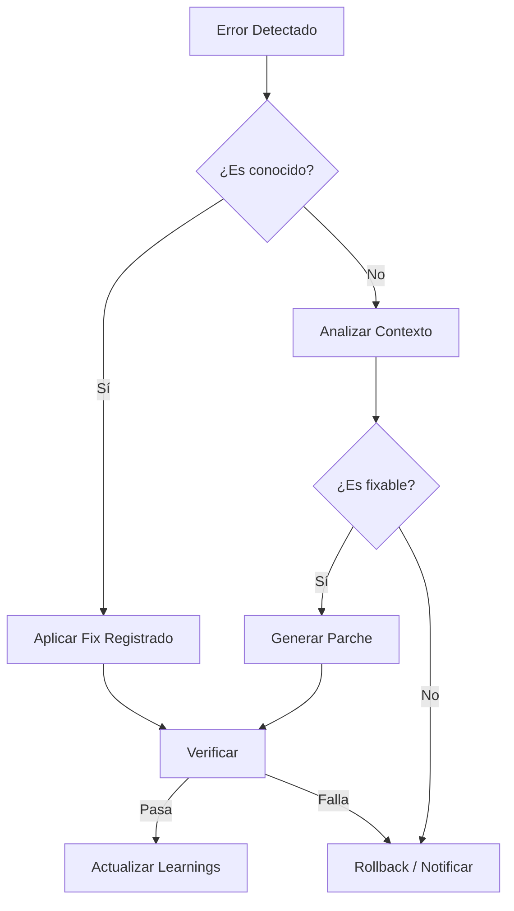

# Error Recovery Skill (Self-Healing)

Este skill dota al agente de la capacidad de recuperarse ante fallos de ejecución, errores de compilación o excepciones no controladas.

## Capacidades

### 1. Análisis de Logs
- Leer salidas de error de terminal (stderr)
- Parsear logs de build (Next.js, TypeScript errors)
- Identificar stack traces críticos

### 2. Diagnóstico
Clasifica el error en categorías:
- **SINTAXIS**: Error de tipeo, falta de paréntesis, imports rotos (`ts-node` check).
- **SEMÁNTICA**: Tipos incompatibles, variables no usadas (Linter).
- **RUNTIME**: Excepciones en ejecución, timeouts, fallos de red.
- **ENTORNO**: Falta de dependencias, variables de entorno perdidas.

### 3. Estrategias de Corrección
El agente seleccionará la estrategia según la categoría:

#### A. Estrategia "Quick Fix" (Sintaxis/Linter)
1. Leer el archivo afectado en la línea del error.
2. Aplicar corrección obvia (agregar import, corregir typo).
3. Re-ejecutar verificación.

#### B. Estrategia "Rollback" (Runtime Crítico)
1. Identificar último commit estable.
2. Ejecutar `git revert` o restaurar archivo específico.
3. Registrar el fallo para análisis posterior.

#### C. Estrategia "Search & Apply" (Desconocido)
1. Buscar el mensaje de error en la base de conocimientos (`.agent/memory/learnings.md`).
2. Si no existe, buscar patrones similares en el código.
3. Proponer solución basada en contexto.

---

## Uso desde Workflow

```bash
# Analizar último error registrado
/error-recovery --analyze last-error.log

# Intentar arreglar archivo específico
/error-recovery --fix ./app/page.tsx --error "Module not found"

# Modo guardián (ejecutar comando y recuperar si falla)
/error-recovery --run "npm run build"
```

---

## Flujo de Recuperación



---

## Archivos del Skill

```
.agent/skills/error-recovery/
├── SKILL.md
├── scripts/
│   ├── analyze-log.ts    # Parser de logs
│   ├── apply-fix.ts      # Aplicador de parches
│   └── rollback.ts       # Gestor de versiones
└── knowledge/
    └── common-errors.json # BD de errores frecuentes
```
