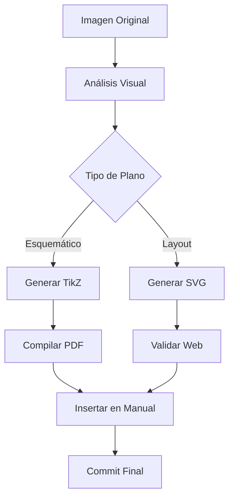

# Plan Restoration Skill

Este skill transforma fotografías o escaneos de planos técnicos en versiones digitales vectorizadas de alta calidad.

## Capacidades

### 1. Análisis de Imagen
- Detectar componentes (motores, cintas, sensores)
- Identificar flujo del proceso
- Extraer etiquetas y textos
- Determinar proporciones espaciales

### 2. Generación de Código
- **TikZ** para manuales PDF
- **SVG** para aplicación web
- **Mermaid** para documentación

### 3. Verificación
- Comparación visual con original
- Validación de componentes
- Revisión de etiquetas

---

## Scripts Disponibles

### `analyze-plan.ts`
Analiza una imagen y extrae información estructurada.

```typescript
import { analyzePlanImage } from './analyze-plan';

const result = await analyzePlanImage('/path/to/image.jpg');
// Returns: { components: [...], connections: [...], labels: [...] }
```

### `generate-svg.ts`
Genera SVG a partir de datos estructurados.

```typescript
import { generateSVG } from './generate-svg';

const svg = generateSVG({
  components: [...],
  connections: [...],
  style: 'industrial-dark'
});
```

### `generate-tikz.ts`
Genera código TikZ para LaTeX.

```typescript
import { generateTikZ } from './generate-tikz';

const tikz = generateTikZ(planData, { scale: 1.5 });
```

---

## Flujo de Trabajo



---

## Uso desde Workflow

```bash
# Ejecutar restauración completa
/plan-restoration --input /path/to/image.jpg --output /public/diagrams/

# Solo análisis
/plan-restoration --analyze /path/to/image.jpg

# Solo generación
/plan-restoration --generate --format svg --data ./plan-data.json
```

---

## Estándares de Calidad

### Estilo Industrial AISA
- Fondo oscuro (#1a1a2e o #1a202c)
- Acentos rojos (#e74c3c, #f56565) para puntos de lubricación
- Azules (#2b6cb0, #3498db) para equipos hidráulicos
- Verdes (#27ae60, #48bb78) para transportes
- Tipografía sans-serif limpia

### Elementos Obligatorios
- [ ] Título del plano
- [ ] Leyenda
- [ ] Puntos de lubricación marcados (símbolo L)
- [ ] Lista de equipos con códigos
- [ ] Flechas de flujo de material
- [ ] Footer con revisión y fecha

---

## Archivos del Skill

```
.agent/skills/plan-restoration/
├── SKILL.md (este archivo)
├── scripts/
│   ├── analyze-plan.ts
│   ├── generate-svg.ts
│   ├── generate-tikz.ts
│   └── validate-output.ts
├── templates/
│   ├── industrial-dark.svg
│   └── industrial-light.svg
└── examples/
    ├── 8006-layout.svg
    └── boceto-layout.svg
```
